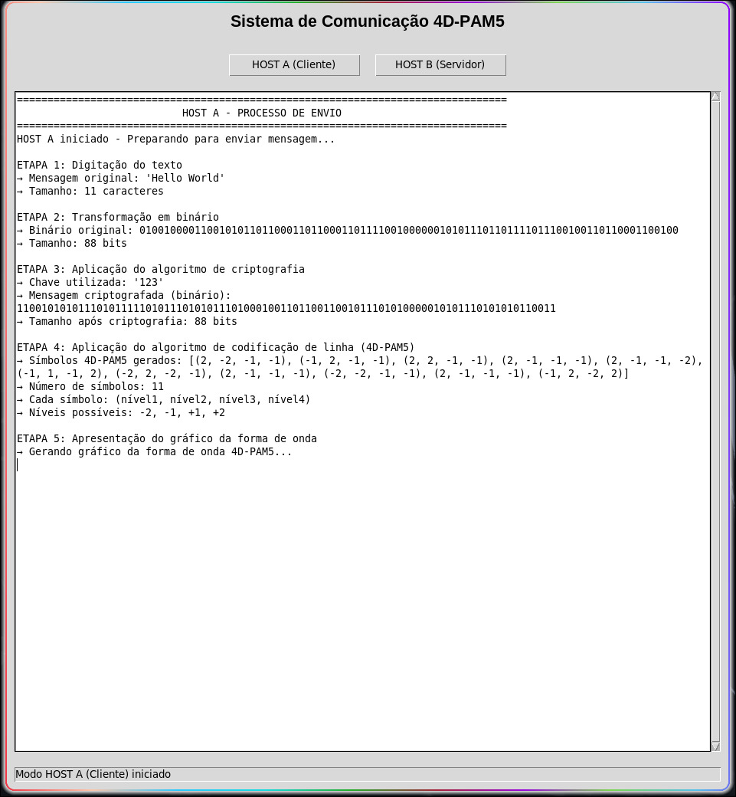
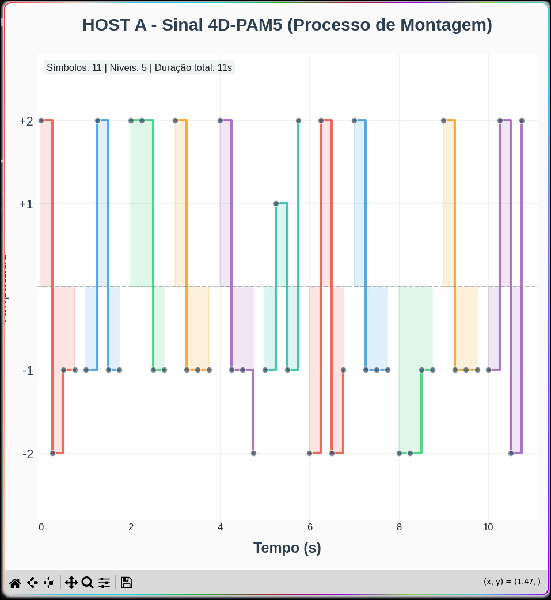

# 4D-PAM5 Communication System

This project implements a simple communication system using the 4D-PAM5 line coding algorithm, with encryption and a graphical interface. It was developed for the Data Communication course.

## Features

- **Client and Server simulation** (Host A and Host B)
- **Encryption and decryption** of messages
- **4D-PAM5 line coding** and decoding
- **Waveform visualization** for both sending and receiving sides
- **Graphical interface** using Tkinter

## Screenshots

### Main Interface

*Main application interface showing the communication system with Host A (Client) and Host B (Server) options. The interface displays the complete communication process including text digitization, binary transformation, cryptography application, 4D-PAM5 line coding, and waveform presentation.*

### 4D-PAM5 Waveform Visualization

*4D-PAM5 signal waveform visualization showing the encoding process. The graph displays 11 symbols over 5 levels with a total duration of 11 seconds, demonstrating the multilevel pulse amplitude modulation used in the communication system.*

## Requirements

- Python 3.8+
- [uv](https://github.com/astral-sh/uv) (for fast dependency management)

## Installation

1. Clone the repository:
   ```bash
   git clone <repo-url>
   cd 4d_pam5_project
   ```

2. Install dependencies using [uv](https://github.com/astral-sh/uv):
   ```bash
   uv venv
   source .venv/bin/activate
   uv sync --all-groups
   ```

## How to Run

1. Run the main application:
   ```bash
   python -m src.main
   ```

2. In the interface:
   - First, click **"HOST B (Servidor)"** to start the server.
   - Then, click **"HOST A (Cliente)"** to send a message.
   - Enter your message and encryption key, then click "Enviar".
   - The process and waveforms will be shown for both sides.

You can also open two instances of the program to simulate client and server in separate windows.

## Project Structure

- `src/` - Source code
  - `gui/app.py` - Main GUI application
  - `client.py`, `server.py` - Communication logic
  - `encoder.py`, `decoder.py` - 4D-PAM5 encoding/decoding
  - `crypto.py` - Encryption utilities
  - `waveform.py` - Waveform plotting
  - `ascii_utils.py` - ASCII/binary conversion

## License

For academic use in the Data Communication course.
